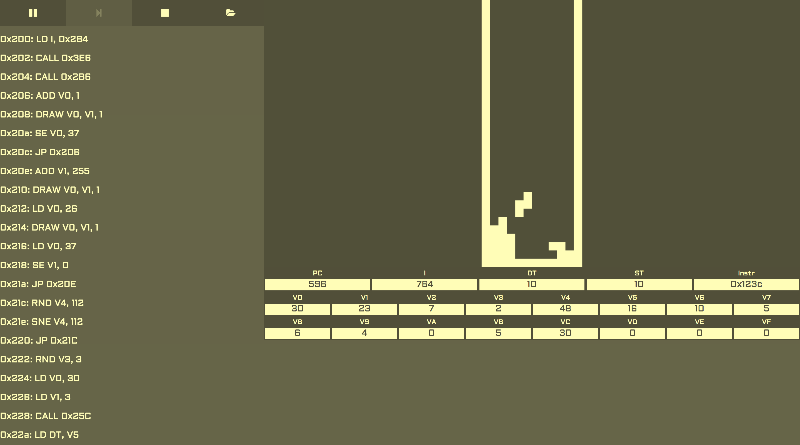

[](https://travis-ci.org/Taiters/chip8-web)

# Chip8 Web

A Chip8 emulator which runs in the browser along with tools to view the registers and instructions etc. The live version can be viewed on Heroku [here](http://chip8-web.herokuapp.com).



## Getting Started

These instructions will get you a copy of the project up and running on your local machine for development and testing purposes. See deployment for notes on how to deploy the project on a live system.

### Prerequisites

To avoid any versioning issues, we recommend using [nvm](https://github.com/creationix/nvm) to manage the version of node and npm used in the project.


### Installing

Install the dependencies

```
npm install
```

Run the dev server

```
npm run start:dev
```

Once the project has finished building, you should be able to view it here: [http://localhost:9000](http://localhost:9000)

## Running the tests

This project uses [jest](https://jestjs.io/) for tests. They can be run with

```
npm test
```

## Deployment

This project is deployed to Heroky via TravisCI. Any commits to master will be deployed automatically to [http://chip8-web.herokuapp.com](http://chip8-web.herokuapp.com/)

## Built With

* [webpack](http://www.dropwizard.io/1.0.2/docs/) - Module bundler
* [Express.js](https://expressjs.com/) - Server framework used for Heroku deployment
* [React](https://reactjs.org/) - UI library

## Contributing

Please read [CONTRIBUTING.md](CONTRIBUTING.md) for details on our code of conduct, and the process for submitting pull requests to us.


## Authors

* **Daniel Tait** - *Initial work* - [Taiters](https://github.com/Taiters)

## Acknowledgements

* [dmatlack/chip8](https://github.com/dmatlack/chip8/tree/master/roms) - *Chip8 ROMS*

See also the list of [contributors](CONTRIBUTORS.md) who participated in this project.
